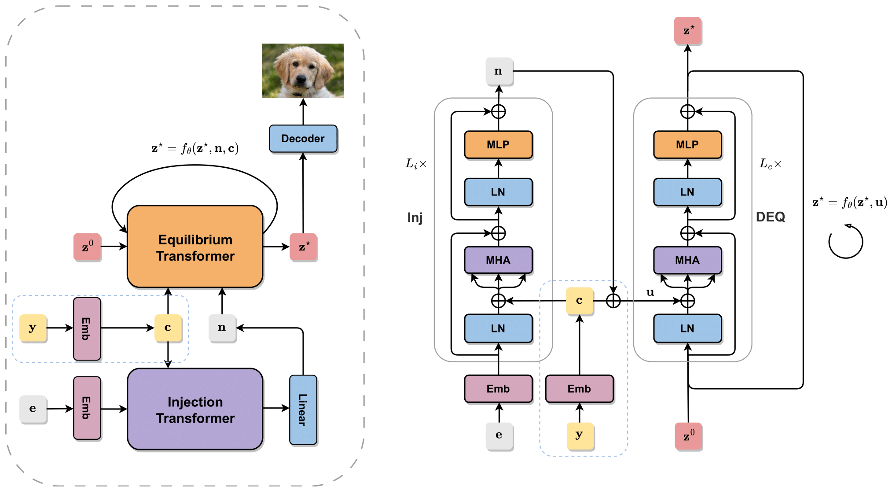

# Generative Equilibrium Transformer

This is the official repo for the paper [*One-Step Diffusion Distillation via Deep Equilibrium Models*](), 
by [Zhengyang Geng](https://gsunshine.github.io/)\*, [Ashwini Pokle](https://ashwinipokle.github.io/)\*, and [J. Zico Kolter](http://zicokolter.com/).

<div align=center></div>

## Environment

## Dataset

First, download the datasets **EDM-Uncond-CIFAR** and **EDM-Cond-CIFAR** from [this link](https://drive.google.com/drive/folders/1dlFiS5ahwu7xne6fUNVNELaG12-AKn4I?usp=sharing).
Set up the `--data_path` in `run.sh` to the dir where you store the datasets, like `--data_path DATA_DIR/EDM-Uncond-CIFAR-1M`.

In addition, download the precomputed dataset statistics from [this link](https://drive.google.com/drive/folders/1UBdzl6GtNMwNQ5U-4ESlIer43tNjiGJC).
Set up the `--stat_path` in `run.sh` and `eval.sh` using your download dir plus stat name.

## Training

To train a GET, run this command:

```bash
bash run.sh N_GPU DDP_PORT --model MODEL_NAME --name EXP_NAME
```

`N_GPU` is the number of GPU used for training.
`DDP_PORT` is the port number for syncing gradient during distributed training.
`MODEL_NAME` is the model's name.
See all available models using `python train.py -h`.
The training log, checkpoints, and sampled images will be saved to `./results` using your `EXP_NAME`.

For example, this command train a GET-S/2 (of patch size 2) on 4 GPUs.

```bash
bash run.sh 4 12345 --model GET-S/2 --name test-GET
```

To train a ViT, run this command:

```bash
bash run.sh N_GPU DDP_PORT --model ViT-B/2 --name EXP_NAME
```

For training **conditional** models, add the `--cond` command.

For the **O(1)-memory** training, add the `--mem` command.

## Evaluation

Download pretrained models from [this link](https://drive.google.com/drive/u/1/folders/1g998S6moSQhybD9poDJHmXP85QF3zz4g).

To load a checkpoint for evaluation, run this command

```bash
bash run.sh N_GPU DDP_PORT --model MODEL_NAME --resume CKPT_PATH --name EXP_NAME
```

The evaluation log and sampled images will be saved to `./eval-results` plus your `EXP_NAME`.

For evaluating conditional models, add the `--cond` command. Here is an example.

```bash
bash run.sh 4 12345 --model GET-B/2 --cond --resume CKPT_DIR/GET-B-cond-2M-data-bs256.pth
```

## Generative Performance

You can see [the generative performance here](STAT.md). The discussion there might be interesting.

## Data Generation

First, clone the EDM repo. Then, copy the files under `/data` to the `/edm` directory.

Set up the `DATA_PATH` in `dataset.sh` for storing the synthetic dataset. 
Run the following command to generate both conditional and unconditional training sets.

```bash
bash dataset.sh
```

If you want to generate more data pairs, adjust the range of `--seeds=0-MAX_SAMPLES`.

## Bibtex

If you find our work helpful to your research, please consider citing this paper. :)

```bib
@inproceedings{
    geng2023onestep,
    title={One-Step Diffusion Distillation via Deep Equilibrium Models},
    author={Zhengyang Geng and Ashwini Pokle and J Zico Kolter},
    booktitle={Thirty-seventh Conference on Neural Information Processing Systems},
    year={2023}
}
```

## Contact

Feel free to contact us if you have additional questions! 
Please drop an email to zhengyanggeng@gmail.com (or [Twitter](https://twitter.com/ZhengyangGeng))
or apokle@andrew.cmu.edu.

## Acknowledgment

This project is built upon [TorchDEQ](https://github.com/locuslab/torchdeq), 
[DiT](https://arxiv.org/abs/2212.09748), 
and [timm](https://github.com/huggingface/pytorch-image-models).
Thanks for the awesome projects!
